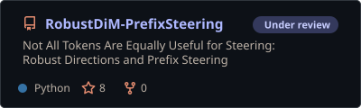
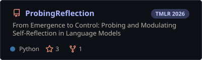
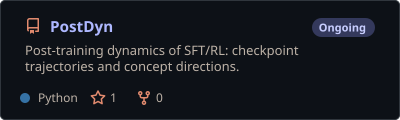
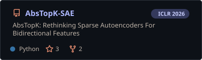
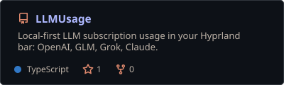
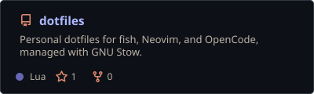
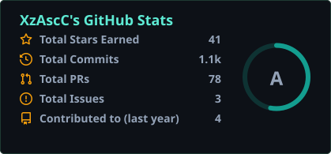

<h1>Xudong Zhu</h1>

  PhD student at <a href="https://www.osu.edu/">The Ohio State University</a>, advised by <a href="https://zhihuizhu.github.io/">Zhihui Zhu</a>. 
  B.Eng. from <a href="https://en.uestc.edu.cn/">UESTC</a>, advised by <a href="https://sites.google.com/site/zhaokanghomepage/">Zhao Kang</a> and <a href="https://sites.google.com/view/hao-dong/home">Hao Dong</a>.

  I study the representations and training dynamics of large language models, 
  with an eye toward mechanistic interpretability.

  <a href="https://xudongzhu.com/"><b>Website</b></a> &nbsp;·&nbsp;
  <a href="https://scholar.google.com/citations?user=U55yracAAAAJ"><b>Google Scholar</b></a> &nbsp;·&nbsp;
  <a href="mailto:zhu.3944@osu.edu"><b>Email</b></a> &nbsp;·&nbsp;
  <a href="https://x.com/XudongZhu3944"><b>X / Twitter</b></a>

### Research

  <a href="https://github.com/xzAscC/RobustDiM-PrefixSteering"><picture><source media="(prefers-color-scheme: dark)" srcset="./assets/pin-robustdim-prefixsteering-dark.svg" /><source media="(prefers-color-scheme: light)" srcset="./assets/pin-robustdim-prefixsteering-light.svg" /></picture></a>
  <a href="https://github.com/xzAscC/ProbingReflection"><picture><source media="(prefers-color-scheme: dark)" srcset="./assets/pin-probingreflection-dark.svg" /><source media="(prefers-color-scheme: light)" srcset="./assets/pin-probingreflection-light.svg" /></picture></a>
  <a href="https://github.com/xzAscC/PostDyn"><picture><source media="(prefers-color-scheme: dark)" srcset="./assets/pin-postdyn-dark.svg" /><source media="(prefers-color-scheme: light)" srcset="./assets/pin-postdyn-light.svg" /></picture></a>
  <a href="https://github.com/GoXzascc/AbsTopK-SAE"><picture><source media="(prefers-color-scheme: dark)" srcset="./assets/pin-goxzascc-abstopk-sae-dark.svg" /><source media="(prefers-color-scheme: light)" srcset="./assets/pin-goxzascc-abstopk-sae-light.svg" /></picture></a>

  Papers:
  <a href="https://openreview.net/forum?id=EEs6I4cO7S">AbsTopK</a> (ICLR 2026) &nbsp;·&nbsp;
  <a href="https://arxiv.org/abs/2506.12217">From Emergence to Control</a> (TMLR 2026) &nbsp;·&nbsp;
  <a href="https://xudongzhu.com/publications/">All publications →</a>

### Building in Public

  <a href="https://github.com/xzAscC/LLMUsage"><picture><source media="(prefers-color-scheme: dark)" srcset="./assets/pin-llmusage-dark.svg" /><source media="(prefers-color-scheme: light)" srcset="./assets/pin-llmusage-light.svg" /></picture></a>
  <a href="https://github.com/xzAscC/dotfiles"><picture><source media="(prefers-color-scheme: dark)" srcset="./assets/pin-dotfiles-dark.svg" /><source media="(prefers-color-scheme: light)" srcset="./assets/pin-dotfiles-light.svg" /></picture></a>

  <picture>
    <source media="(prefers-color-scheme: dark)" srcset="./assets/stats-dark.svg" />
    <source media="(prefers-color-scheme: light)" srcset="./assets/stats-light.svg" />
    
  </picture>

---

Happy to chat about interpretability and LLM research — <a href="mailto:zhu.3944@osu.edu">email me</a>. Cards are regenerated daily from public GitHub data by a GitHub Action; styling adapted from <a href="https://github.com/stats-organization/github-stats-extended">github-stats-extended</a>.

